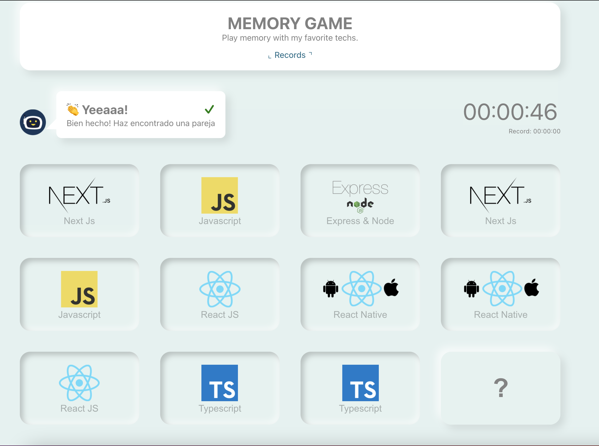

# Memory Tech - Game

Developed by Marco Mesén - [marcomesen.com](https://marcomesen.com)

## Demo

[Live Demo - Link](https://tech-memory.web.app/)


## Start proyect

1. run `yarn install`
2. create `.env` file in the root, use `example.env` as a guide.
3. run `yarn start`

## Tech

- [React](https://reactjs.org/)
- [Create React App](https://github.com/facebook/create-react-app)
- [React-Router](https://reactrouter.com/)
- [Hooks](https://es.reactjs.org/docs/hooks-intro.html)

## Architecture

The project was developed with Flux Architecture for State Managment - Based on this article: [marcomesen.com/blog](https://marcomesen.com/blog/state-handling-in-react-with-flux-architecture-using-usecontext-and-usereducer-hook)

```
-src
---app                ~ Entry point for app, routing and some app generalities.
---assets             ~ Assets as images and SVGs
---components         ~ Components for app
---pages              ~ Sreens for APP
-----Game             ~ Login
-----Records          ~ Mainly Screen
---services           ~ Services config (Firebase)
---state              ~ All the logic for State Managment.
---utils              ~ Some utils functions
```

## Available Scripts

This project was bootstrapped with [Create React App](https://github.com/facebook/create-react-app).

In the project directory, you can run:

### `yarn start`

Runs the app in the development mode.\
Open [http://localhost:3000](http://localhost:3000) to view it in the browser.

The page will reload if you make edits.\
You will also see any lint errors in the console.

### `yarn test`

Launches the test runner in the interactive watch mode.\
See the section about [running tests](https://facebook.github.io/create-react-app/docs/running-tests) for more information.

### `yarn build`

Builds the app for production to the `build` folder.\
It correctly bundles React in production mode and optimizes the build for the best performance.

The build is minified and the filenames include the hashes.\
Your app is ready to be deployed!

See the section about [deployment](https://facebook.github.io/create-react-app/docs/deployment) for more information.

## Learn More About React and Create-React-App

You can learn more in the [Create React App documentation](https://facebook.github.io/create-react-app/docs/getting-started).

To learn React, check out the [React documentation](https://reactjs.org/).

## Icons

This project used icons from [TablerIcons](https://tablericons.com/)
